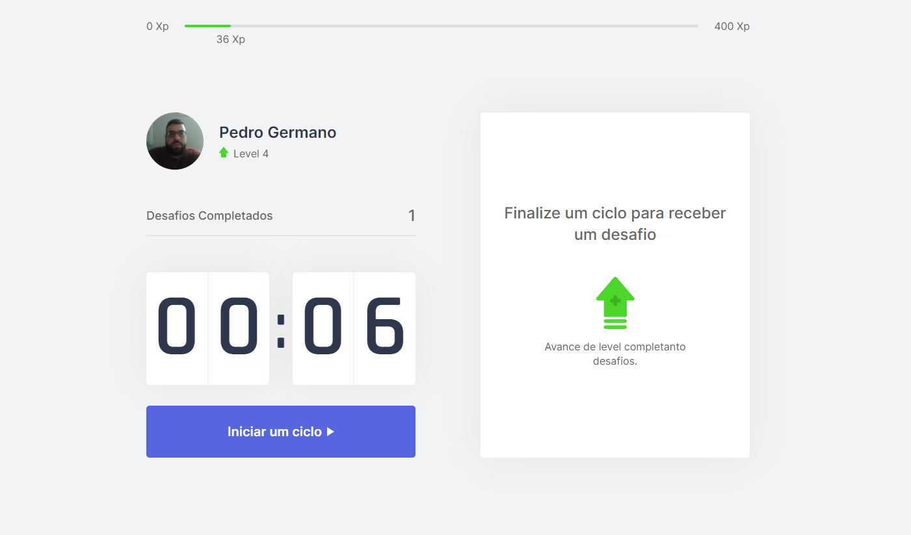
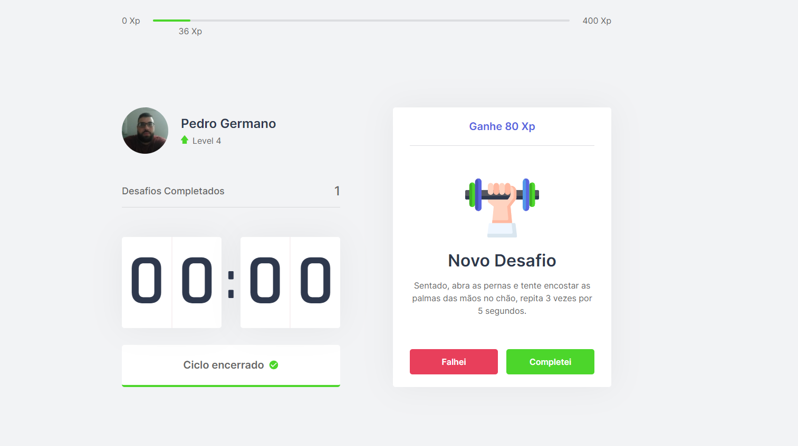

<h1 align="center">
    Projeto Move.it
</h1>
<!--
<h2 align="center">
  Travel to San Francisco Safely
</h2> -->


<p align="center">
  
  
</p>

## 💻 Projeto

Esse projeto foi desenvolvido na nlw 4.

Dependências usadas no projeto:
-  [React.js](https://pt-br.reactjs.org/)
-  [Next.js](https://nextjs.org/)
-  [TypeScript](https://www.typescriptlang.org/)

## Crédito

-  [Rocketseat](rocketseat.com.br)


## 📥 Instalação e execução

Faça um clone desse repositório e acesse o diretório.

```bash
# Instalando as dependências
$ yarn

# Executanto aplicação
$ yarn next
```